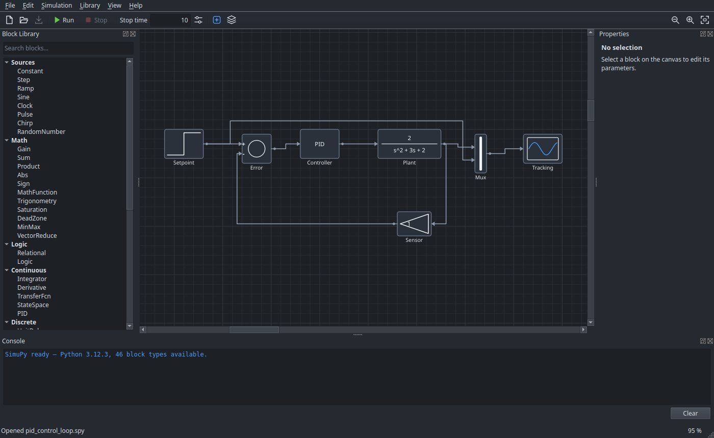

======
SimuPy
======

A block-diagram simulator in the spirit of Simulink, where custom blocks are
written in Python.

The engine, the editor and the solvers are C++. When a diagram needs behaviour
that no built-in block provides, you drop in a **Python** block and write it as
a small class — no plugin to compile, no restart. The script is recompiled at
the start of every run, so editing and pressing :guilabel:`Run` is the whole
loop.

.. rubric:: What it does

* Variable- and fixed-step solvers, with **event location** so a switching
  model lands exactly on its discontinuities.
* **Algebraic loops are solved**, not refused, by Newton iteration on the torn
  signals.
* **Subsystems** with mask parameters, saved into shareable block libraries.
* **Real-time pacing** and **interactive controls**, so a model can be watched
  and driven while it runs.
* **Hardware in the loop** over UDP, serial, ROS 2, or an Arduino running the
  bundled firmware.

.. toctree::
   :maxdepth: 2
   :caption: Getting started

   installation
   first-model

.. toctree::
   :maxdepth: 2
   :caption: User guide

   guide/editor
   guide/subsystems
   guide/signals
   guide/simulation
   guide/controls
   guide/libraries
   guide/hardware

.. toctree::
   :maxdepth: 2
   :caption: Reference

   reference/blocks
   reference/python-blocks
   reference/file-formats
   reference/command-line

.. toctree::
   :maxdepth: 2
   :caption: Internals

   internals/architecture
   internals/engine

.. toctree::
   :maxdepth: 1
   :caption: About

   limitations

Indices
=======

* :ref:`genindex`
* :ref:`search`
